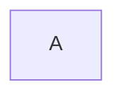

# 第一个标题
## 第二个标题
### 第三个标题
*斜体*

**粗体**

***斜粗体***

建立分割线

***

~~删除线~~

<u>下划线</u>

[^脚注文本]

[^脚注文本]：111

***

无序列表用* + -号

* 第一项
* 第二项
* 第三项
* 。。。

有序列表用数字加.号

1. 第一项

2. 第二项

***

区块引用

>1

>2

>3

区块嵌套

>1

>>2

>>>3

***

代码段落

`function(){}`

代码块（Tab键）
    
    function(){
        console.log('hello world');
    }


```javascript
function(){
    console.log('hello world');
}
```

***

链接

[斗鱼](https://www.douyu.com)

[B站][1]

[1]:https://www.bilibili.com

***

图片


***

表格

| 左对齐 | 右对齐 |居中对齐 |
| :--- | ---: | :---:|
|单元格|单元格|
|单元格|单元格|

***

## 在markdown 中画流程图




